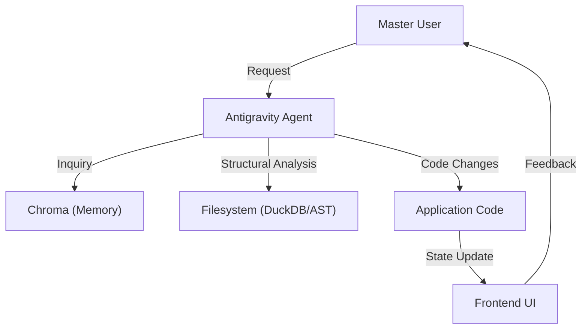

# System Architecture: <PROJECT_NAME>

> **AI Instruction**: Populate this blueprint after **Repo-first analysis** and **DuckDB Audit** (`/librarian`). This file is the primary cognitive map for the agent.

## 1. Executive Summary
- **Vision**: <SYSTEM_VISION_STATEMENT>
- **Core Objective**: <PRIMARY_BUSINESS_PROBLEM_SOLVED>
- **Target Environment**: <TARGET_OS_AND_RUNTIME> (e.g., Ubuntu Server, Browser, Edge)

---

## 2. The Tech Stack (High-Res)
### 🖥️ Frontend Layer
- **Framework**: <FRONTEND_FRAMEWORK>
- **State Strategy**: <STATE_TYPE> (e.g., Reactive Proxy, Event Sourcing, Context)
- **Visual Core**: <CSS_STRATEGY> (e.g., HSL Design Tokens, Modular CSS)

### ⚙️ Backend & Logic
- **Engine**: <BACKEND_ENGINE>
- **Data Persistence**: <DB_TYPE> & <ORM_IF_ANY>
- **Communication**: <API_TYPE> (e.g., REST, WebSockets, gRPC)

### 🧠 AI & Agentic Layer (Antigravity Core)
- **LLM Context**: <LLM_MODEL_PREFERENCE>
- **RAG Engine**: ChromaDB (Collections: `fix_logs`, `research_summaries`, `decisions`)
- **Workflow Engine**: Antigravity Workflows (`.agent/workflows/`)

---

## 3. Data & Logic Flow (Mermaid)

---

## 4. Memory & Context Architecture
- **Short-term Memory**: <CONTEXT_WINDOW_STRATEGY> (File reading, Task history)
- **Long-term Memory**: 
    - **Conceptual**: ChromaDB `research_summaries`.
    - **Procedural**: `.agent/workflows/` and `PROJECT_RULES.md`.
    - **Historical**: ChromaDB `fix_logs`.

---

## 5. Safety, Security & Guardrails
- **Scope**: <WORKSPACE_BOUNDARY> (Defaults to project root)
- **Secrets Management**: <SECRETS_POLICY> (e.g., `.env` isolation as per `.agent/rules`)
- **Action Blocking**: <BLOCKING_CRITERIA> (e.g., Hard Interrupt on destructive operations)

---

## 6. Domain Responsibility Map
- `src/`: <FRONTEND_LOGIC_RESPONSIBILITY>
- `backend/`: <SERVER_SIDE_RESPONSIBILITY>
- `.agent/`: Ecosistema Agentico (Config, Rules, Workflows)
- `docs/`: Autorità del Progetto (Canon)

---

## 7. Agentic UX & Interaction Policy
- **Design Philosophy**: <UI_DESIGN_PHILOSOPHY> (e.g., Premium Dark Mode, Glassmorphism)
- **Refactoring Standard**: <REFACTOR_LEVEL> (e.g., AST-First, No String-Grep)
- **Verification Standard**: <TEST_LEVEL> (e.g., Playwright E2E Mandatory)

---

## 8. Scalability & Health (SHIP)
- **Limitazioni Note**: <KNOWN_LIMITATIONS>
- **Monitoraggio**: <HEALTH_CHECK_STRATEGY> (e.g., Librarian Audit, Ship Protocol)

---
