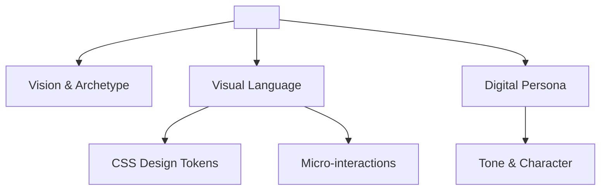

# Brand Identity Guide: <PROJECT_NAME>

> **AI Instruction**: Fill this guide after analyzing project assets, CSS variables, and public file structure via **Repo-first analysis**. This guide ensures visual and tonal consistency.

## 1. Core Identity & Archetype
- **Mission**: <MISSION_STATEMENT>
- **Archetype**: <BRAND_ARCHETYPE> (e.g., The Rebel, The Sage, The Hero)
- **Personality Adjectives**: 
    - <ADJECTIVE_1>
    - <ADJECTIVE_2>
    - <ADJECTIVE_3>

---

## 2. Visual Design System (Tokens)
### 🎨 Color Palette (Standard Tokens)
Implement these as CSS variables in `:root`:

| Token | Variable | Value (Placeholder) |
| :--- | :--- | :--- |
| **Primary** | `--color-primary` | `<COLOR_PRIMARY_HEX>` |
| **Secondary** | `--color-secondary` | `<COLOR_SECONDARY_HEX>` |
| **Surface** | `--color-surface` | `<COLOR_SURFACE_HEX>` |
| **Text Main** | `--color-text-main` | `<COLOR_TEXT_MAIN_HEX>` |
| **Accent** | `--color-accent` | `<COLOR_ACCENT_HEX>` |

### 🔡 Typography
- **Headings**: `<FONT_FAMILY_HEADINGS>` (Style: <WEIGHT_BOLD>)
- **Body**: `<FONT_FAMILY_BODY>`
- **Scale**: <TYPOGRAPHY_SCALE_RATIO> (e.g., 1.25 Modular Scale)

---

## 3. Digital Persona (Agent Tone of Voice)
### The Voice Scale
- **Formal vs Casual**: <FORMAL_CASUAL_SCORE> (1-10)
- **Serious vs Witty**: <SERIOUS_WITTY_SCORE> (1-10)
- **Technical vs Narrative**: <TECH_NARRATIVE_SCORE> (1-10)

### Communication Guidelines
- **Internal (Code/Comments)**: <INTERNAL_COMMUNICATION_STYLE>
- **External (User/UI)**: <EXTERNAL_COMMUNICATION_STYLE>

---

## 4. Motion & Micro-interactions
- **Easing Function**: `cubic-bezier(<BEZIER_VALUES>)`
- **Transition Speeds**:
    - **Snappy**: <SNAP_SPEED_MS>
    - **Smooth**: <SMOOTH_SPEED_MS>
- **Feedback Loop**: <UI_FEEDBACK_STYLE> (e.g., Subtle glows, Haptic-style scale down)

---

## 5. Generative AI Asset Policy
### `generate_image` Prompt DNA
To maintain aesthetic consistency, always include these keywords in your prompts:
> "Symmetry, <STYLE_KEYWORD_1>, <STYLE_KEYWORD_2>, Cinematic Lighting, High Fidelity, 8k, <PRIMARY_COLOR> highlights."

---

## 6. Brand DNA Ecosystem (Mermaid)

