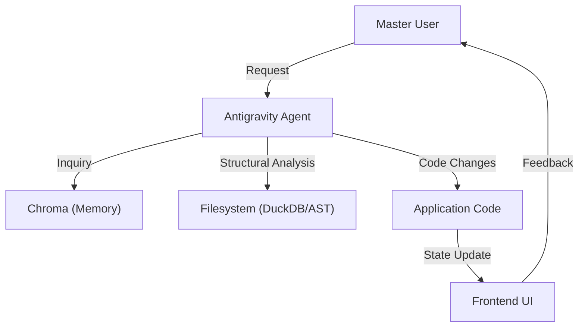

# System Architecture: Antigravity

> **AI Instruction**: Populate this blueprint after **Repo-first analysis** and **DuckDB Audit** (`/librarian`). This file is the primary cognitive map for the agent.

## 1. Executive Summary
- **Vision**: Guidare alla realizzazione dei migliori template operativi
- **Core Objective**: Realizzazione dei migliori template operativi
- **Target Environment**: Ubuntu Server (Standard Antigravity)

---

## 2. The Tech Stack (High-Res)
### 🖥️ Frontend Layer
- **Framework**: React
- **State Strategy**: Context / React Query (Inferito da Standard)
- **Visual Core**: Minimal Design (CSS Variables)

### ⚙️ Backend & Logic
- **Engine**: Python
- **Data Persistence**: Postgres & SQLAlchemy (Standard)
- **Communication**: REST (Standard)

### 🧠 AI & Agentic Layer (Antigravity Core)
- **LLM Context**: Gemini / SOTA model
- **RAG Engine**: ChromaDB (Collections: `fix_logs`, `research_summaries`, `decisions`)
- **Workflow Engine**: Antigravity Workflows (`.agent/workflows/`)

---

## 3. Data & Logic Flow (Mermaid)

---

## 4. Memory & Context Architecture
- **Short-term Memory**: File reading, Task history
- **Long-term Memory**: 
    - **Conceptual**: ChromaDB `research_summaries`.
    - **Procedural**: `.agent/workflows/` and `PROJECT_RULES.md`.
    - **Historical**: ChromaDB `fix_logs`.

---

## 5. Safety, Security & Guardrails
- **Scope**: Project Root (Defaults to `/home/ubuntu/Progetti/IDE_Sviluppo/Antigravity`)
- **Secrets Management**: `.env` isolation as per `.agent/rules`
- **Action Blocking**: Hard Interrupt on destructive operations

---

## 6. Domain Responsibility Map
- `src/`: Frontend UI & Logic
- `backend/`: API & Business Logic
- `.agent/`: Ecosistema Agentico (Config, Rules, Workflows)
- `docs/`: Autorità del Progetto (Canon)
- `docs_custom/`: Documentazione Specifica del Progetto (Source of Truth)

---

## 7. Agentic UX & Interaction Policy
- **Design Philosophy**: Minimal (Clean, Essential, High Contrast)
- **Refactoring Standard**: AST-First, No String-Grep
- **Verification Standard**: Playwright E2E Mandatory

---

## 8. Scalability & Health (SHIP)
- **Limitazioni Note**: None yet.
- **Monitoraggio**: Librarian Audit, Ship Protocol

---
