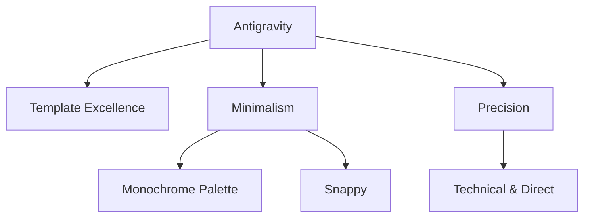

# Brand Identity Guide: Antigravity

> **AI Instruction**: This guide ensures visual and tonal consistency for the Antigravity project.

## 1. Core Identity & Archetype
- **Mission**: Guidare alla realizzazione dei migliori template operativi
- **Archetype**: The Creator / The Sage
- **Personality Adjectives**: 
    - Minimal
    - Functional
    - Precision

---

## 2. Visual Design System (Tokens)
### 🎨 Color Palette (Standard Tokens)
Implement these as CSS variables in `:root`:

| Token | Variable | Value (Minimal Theme) |
| :--- | :--- | :--- |
| **Primary** | `--color-primary` | `#000000` (Black) |
| **Secondary** | `--color-secondary` | `#FFFFFF` (White) |
| **Surface** | `--color-surface` | `#F5F5F5` (Light Grey) |
| **Text Main** | `--color-text-main` | `#111111` (Near Black) |
| **Accent** | `--color-accent` | `#333333` (Charcoal) |

### 🔡 Typography
- **Headings**: `Inter` or `Roboto` (Style: Bold)
- **Body**: `Inter`
- **Scale**: 1.2 (Moderate Scale)

---

## 3. Digital Persona (Agent Tone of Voice)
### The Voice Scale
- **Formal vs Casual**: 8 (Professional)
- **Serious vs Witty**: 7 (Focused)
- **Technical vs Narrative**: 8 (Technical Precision)

### Communication Guidelines
- **Internal (Code/Comments)**: Concise, imperative, standard Google Style docstrings.
- **External (User/UI)**: Essential, no-nonsense, clear instructions.

---

## 4. Motion & Micro-interactions
- **Easing Function**: `cubic-bezier(0.16, 1, 0.3, 1)` (Ease Out Expo)
- **Transition Speeds**:
    - **Snappy**: 150ms
    - **Smooth**: 300ms
- **Feedback Loop**: Subtle border changes, monochromatic highlights.

---

## 5. Generative AI Asset Policy
### `generate_image` Prompt DNA
To maintain aesthetic consistency, sempre include questi keyword nei prompt:
> "Symmetry, Minimalist, B&W, Line Art, Technical Schematic, High Fidelity, 8k, Black highlights."

---

## 6. Brand DNA Ecosystem (Mermaid)

---
